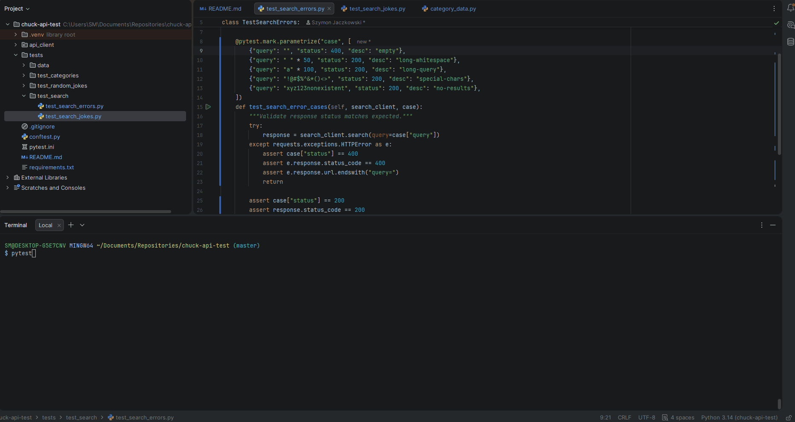

# Chuck Norris Jokes API Test Repository

### Run tests
pytest


```
chuck-norris-api-test/
├── api_client/                 
│   ├── base_client.py
│   └── endpoints/
│       ├── jokes.py
│       └── categories.py
│       └── search.py
├── tests/                      
│   ├── data/
│   ├── test_categories/
│   ├── test_random_jokes/
│   ├── test_search/
└── conftest.ini
└── pytest.ini
```

### API Endpoints Tested

- `GET /jokes/random` - Get random Chuck Norris joke
- `GET /jokes/random?category={category}` - Get joke from specific category
- `GET /jokes/categories` - List all available categories
- `GET /jokes/search?query={query}` - Search jokes by keyword

### Test Suite Overview
| Area                 | Test file                                         | What is validated                                                                                                                                                                                                                                                                                                                                    | Why this validation is important                                                                                                                                                                                                                                                                                                            |
|:---------------------|:--------------------------------------------------|:-----------------------------------------------------------------------------------------------------------------------------------------------------------------------------------------------------------------------------------------------------------------------------------------------------------------------------------------------------|:--------------------------------------------------------------------------------------------------------------------------------------------------------------------------------------------------------------------------------------------------------------------------------------------------------------------------------------------|
| Random jokes         | `tests/test_random_jokes/test_get_random_joke.py` | - HTTP 200 for random joke endpoint<br>- All core fields present (`id`, `value`, `icon_url`, `url`)<br>- Types and minimal content rules for each field (non‑empty strings, reasonable joke length)<br>- Random jokes fetched both with and without category parameter for a sample of known categories<br>- Basic variability across multiple calls | Guarantees that the main joke endpoint is always available, returns a structurally complete joke object, and behaves the same way when filtered by category. This prevents silent regressions where the service starts returning partial data, wrong types, or the same joke repeatedly, which would break UI and client expectations.      |
| Joke structure       | `tests/test_random_jokes/test_joke_structure.py`  | - JSON Schema validation of the random joke response against `JOKE_RESPONSE_SCHEMA`<br>- Presence of all required fields<br>- Additional field‑level rules: minimum `value` length, valid `url`/`icon_url` shape, `categories` is a list of strings<br>- Extra fields from the API are allowed but core contract must remain stable                  | Focuses on the schema contract rather than just status codes. Combining schema validation with targeted assertions ensures client code can safely rely on the response shape even if the API adds new metadata, and that jokes contain meaningful text and well‑formed links suitable for rendering or logging.                             |
| Search (happy path)  | `tests/test_search/test_search_jokes.py`          | - 200 responses for typical search queries (e.g. “chuck”, “norris”)<br>- Presence and types of `total` and `result` fields<br>- `result` is a list and its size is consistent with `total` (for non‑error cases)<br>- Case‑insensitivity, partial matches, extra whitespace, and simple Unicode queries are all accepted                             | Verifies that the search endpoint behaves like a robust text search service. These tests confirm that user input variations still produce a stable JSON envelope, so frontends can display results and counts reliably without special‑casing different query formats or worrying about missing keys.                                       |
| Search (edge cases)  | `tests/test_search/test_search_errors.py`         | - Expected HTTP 400 for an empty query string, handled via `try/except`<br>- For “edge but valid” inputs (long strings, special characters, obviously nonexistent terms) the API returns 200 with `total == 0` and `result` as an empty list<br>- `result` is always a list, even in error‑style scenarios that return an empty set                  | Ensures that failure modes for the search API are predictable and safe to consume. Empty and malformed queries are validated to either raise a controlled 400 or return an empty result set with a consistent shape, which allows client code to implement simple error and “no results” handling without dealing with unexpected payloads. |
| Categories catalogue | `tests/test_categories/test_get_categories.py`    | - Categories endpoint returns HTTP 200 and a non‑empty list<br>- All items are lowercase strings with valid characters<br>- No duplicate categories and list is sorted alphabetically<br>- A subset of known categories (e.g. `animal`, `career`, `dev`, `movie`, `science`) is present and can be used to fetch valid jokes                         | Validates the integrity of the category list used by other endpoints. By checking type, casing, uniqueness, ordering, and presence of key categories, these tests ensure that filters and UI elements built on top of categories remain stable, and that each advertised category can actually be used to retrieve jokes from the API.      |

## Test execution example

